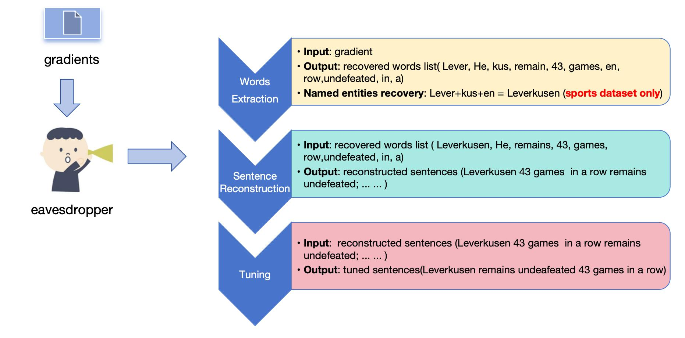
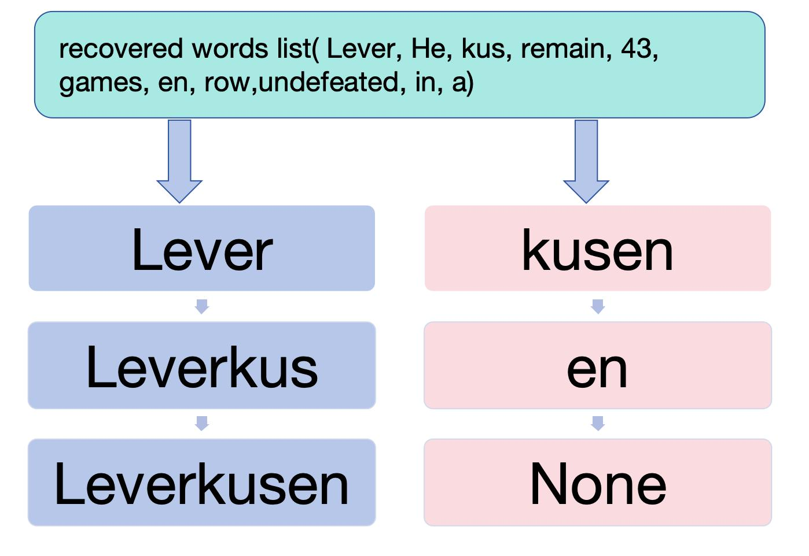

# Privacy-Acquisition-Algorithm-in-Federated-Learning
This is my undergraduate graduation project about a method to extract private information from federated learning. It is based on previous FILM attack(https://github.com/Princeton-SysML/FILM).

# Introduction
The scenario of my experiment is that there is a curious eavesdropper who is a part of the clients in federated learning and has access to the word embedding gradients. Whenever the server is sending word embedding gradients to clients, the eavesdropper can have access to the gradients. Then the eavesdropper can use inversion attack to deduce the words that are highly likely to be in the training data and extract them.

# Attacking Process
1. Inspired by previous researches, in the first step of my attack, I choose to recover a set of words of a sentence from the word embedding gradients observed by considering
the rows that have larger mean value than a certain threshold to be valid and thus the word is in the training data.
2. At the next step, while the words have been extracted, I try to reconstruct a whole sentence. The process started with a beginning word, and then by repeatedly choose next word base on the possibility , I can generate a sentence.
3. The final step serves as a tuning step. Although the sentence has been reconstructed, it might not be easy to understand because the order of words are random. The sentence
may be grammatically correct, but semantically wrong. This step is introduced to randomly perform swap, insert or move subsequence operations to generated new sentences.Finally, I choose the best sentence based on the sum of gradient loss and perplexity calculated by a gpt2 model.
4. For sports dataset, I use a method called "Named-Entity-Recovery" to improve the attacking performance. A named entity may be very long and thus it may be separated into some smaller words. This method is to combine those words together to get a complete named entity.
   

# Result
Before I talk about my result, let me explain a parameter that will be used in this part. Interval i means there should be at least i words between two same words in a recovered sentence. 
My method use the same datasets (Wikitext and Enron Email) as the previous study did. I also conduct experiment on a sports dataset. The result shows that when the interval is 6, my attacking method can achieve the best performance. Also, my attacking method is overall better than FILM when attacking sports dataset.

